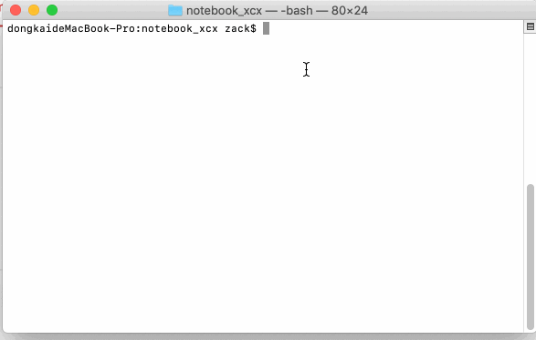

# towxss -- 自动转换less到wxss.

## 为什么有这个工具

习惯了前端的less和sass这种预编译语言，再写小程序的wxss相当不习惯。就有了这个。


## 安装

<pre>
  npm install towxss -g
</pre>

## 使用

用命令行进入到小程序的根目录,towxss启动。



##其他说明

```
Usage: towxss <command> [arg]

OPTIONS:
    --path=<path> //指定你要监控的文件夹
```

会监控文件下所有less文件的改变，并自动转为wxss文件。


